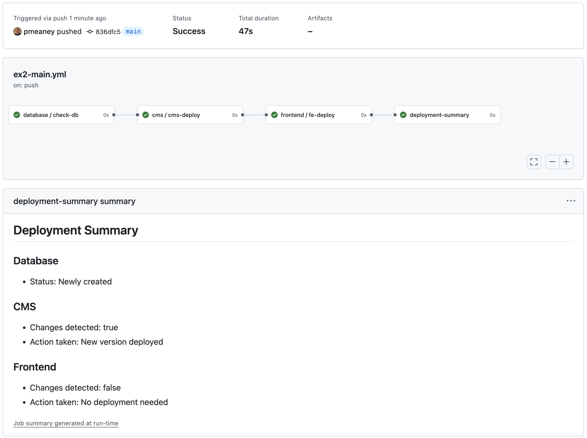

## CICD Workflow templates

Just some example templates to test out some basic features, prior to incorporating those features into projects.

Things to note:

- Workflow files must be in the .github/workflows directory directly. They can't be in subdirectories, or you get this error: `invalid value workflow reference: workflows must be defined at the top level of the .github/workflows/ directory`
  - So, unfortunately, anytime we want to run a template example we need to move its file(s) to the workflows directory

### Example 2: Simulated 3-app stack deployment

An example for deploying a Database ("DB"), Content Management System ("CMS"), and Frontend ("FE").

- DB: Only deploy it once
  - ssh into remote server, check if db container exists. If not, deloy it
- CMS & FE: Only deploy if code has changed
  - check if sourecode has changed. If so, publish a new image. ssh into remote server, deploy new container for each app service (CMS or FE) as needed.

### Example 1: workflow_call

#### Thing to keep in mind:

- A calls B. Therefore, in the particular step where A calls B, the echo statements in B actually appear in the log for A (not B).
